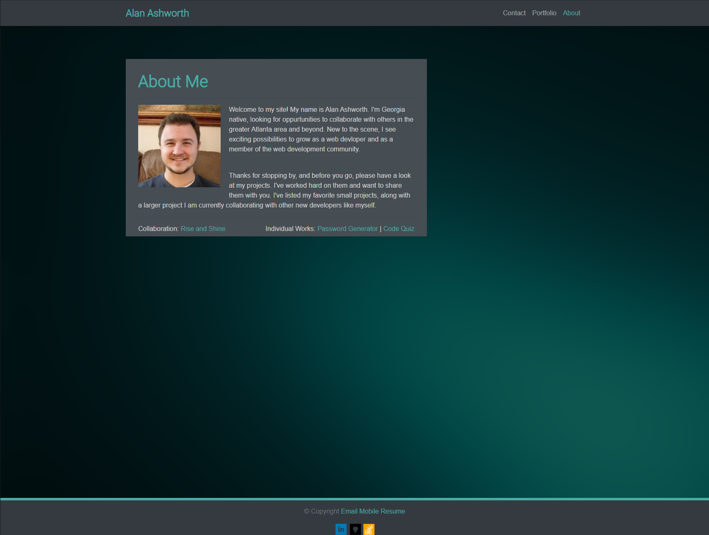
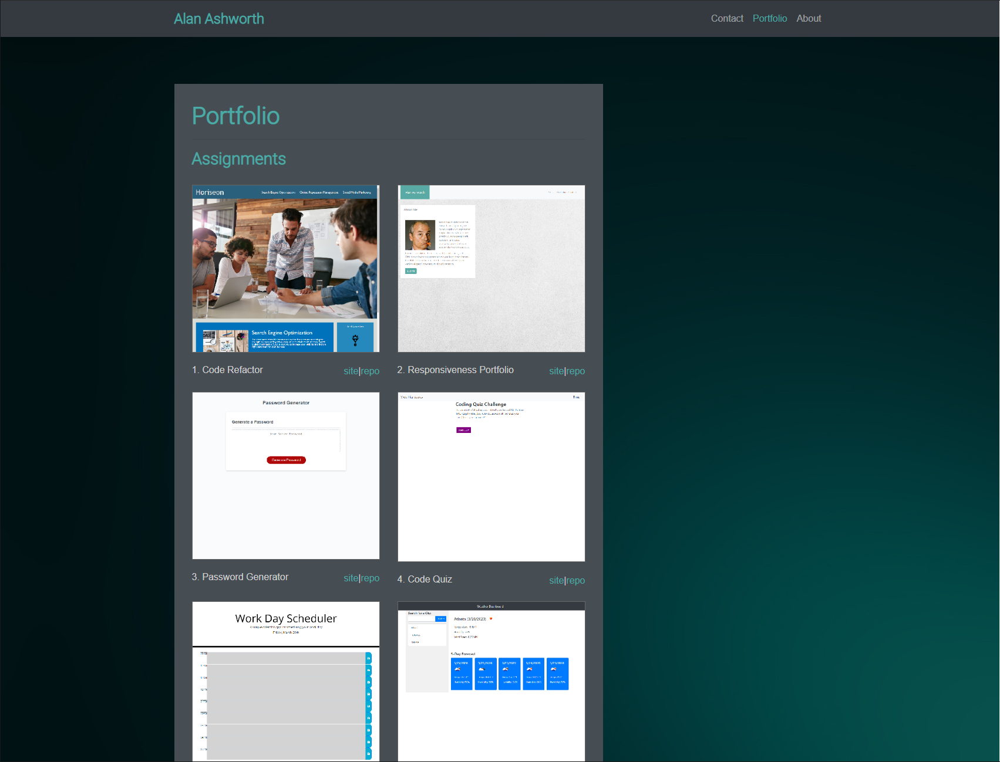
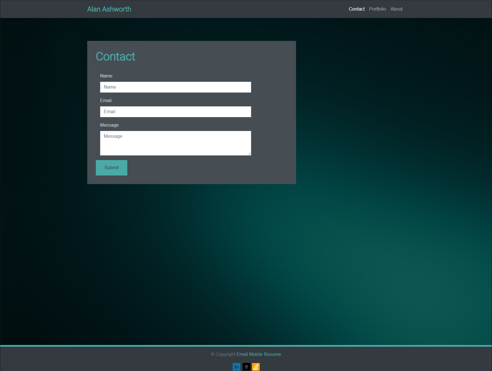

# GT-Homework-08: Updated Portfolio Page
This is my personal website.  The contents in here are hosted on three webpages: 1) About, 2) Portfolio, and 3) Contact.

## Updated Content

The Anout section tells a little about myself.  You can also see my favorite assignments I've worked on, as wells as a collaborative 

project I am involved with.

The Portfolio portion of this site reflects the technologies and practices I have learned throughout this bootcamp. One such technology

which can be seen is the responsiveness of this website. The Potfolio section lists my homework assignments I have worked on, with links 

to the deployed site and its associated repository.

The Contact page is still a work in progress. As the bootcamp has yet to dive into handling data from forms, not much has been done with 
this page.

Lastly, at the foot of the website are links to my various online profiles like Linkedin and my Github online repository.  There is also 
the mailing and phone contact information.

## Screens

The following screens put my website on display.

### About Me

### Portfolio

### Contact
